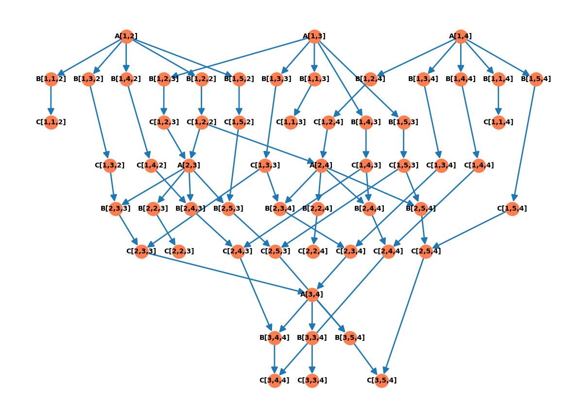

# Opracowanie
## Jakub Barber

### Opis wyznaczania Grafu Dekierta i klas Foata
W celu rozwiązania problemu, podzieliliśmy problem eliminacji Gaussa na sekwencje kroków o trojakim charakterze:
 * obliczanie multiplikatora dla rzędu **j-tego** względem **i-tego** - **A(i,j)**
 * pomnozenie elementu **k-tego** z rzędu **i-tego**, razy odpowiadający mu multiplikator  - **B(i,k,j)**
 * odjęcie wyniku z poprzedniego kroku od **k-tego** elementu w rzędzie **j-tym** - **C(i,k,j)**

 Jako ze kazdy problem eliminacji Gaussa dla kwadratowej macierzy A, o wymiarze nxn mozna sprowadzic do listy atomowych kroków opisanych wyzej,
 Posiadając jedynie wymiar n macierzy A, jesteśmy w stanie skonstruować graf zalezności dla konkretnego problemu (zakładam, ze macierz jest obliczalna bez konieczności stosowania pivotingu).

Graf zaleznosci dla danego problemu konstruujemy schematycznie, zauwazając ponizsze zalezności (pokazane przy pomocy kodu):
* w sposób oczywisty dla j>i, i k: n>k>i widzimy ze zadania B są zalezne od zadan A, oraz zadania C od B:
```python3
    connections_graph[A(i, j)].append(B(i, k, j))
    connections_graph[B(i, k, j)].append(C(i, k, j))
```
* Dla i>0 i k>i, odpowiednie kroki C, muszą być  wykonane przed innymi krokami C oraz B: 
```python3
if i > 0 and k > i:
    connections_graph[C(i - 1, k, j - 1)].append(B(i, k, j))
    connections_graph[C(i - 1, k, j)].append(C(i, k, j))
```
* Dla i>0, odpowiednie kroki C muszą być wykonane przed odpowiadającmi krokami A:
```python3
if i > 0:
    connections_graph[C(i - 1, i, i)].append(A(i, j))
    connections_graph[C(i - 1, i, j)].append(A(i, j))
```

Korzystając z tych zaleznosci jesteśmy w stanie zbudować graf D, dla kazdego problemu eliminacji Gaussa nie wymagajacego pivotingu.
Następnie usuwamy ewentualne nadmiarowe sciezki (nie powinno ich byc na tym etapie, ale w celu stworzenia grafu Dekierta zostawiam to zabezpieczenie).

Z tej postaci grafu, wyznaczamy klasy Foata, uzywajac zmodyfikowanego algorytmu BFS.

Na podstawie wyznaczonych klas mozemy przejsc do rozwiazania problemu współbieeznej wersji aleminacji gaussa.

### Obliczenia współbiezne
Do obliczeń wspolbieznych, uzywam standardowej biblioteki pythona `multiprocessing`. Kazde zadanie odpalam w osobnym procesie. Macierz oraz obliczenia z wcześniejszych etapów przechowywuję w 
wydzielontm obszarze pamięci dla wszystkich działających procesów.

Dla kazdej z grup Foata, uruchamiam tyle procesów ile jest zadań mozliwych do wykonania w danym momencie obliczen. Po uruchomieniu procesów, proces główny czeka az 
wszystkie procesy potomne zakończą swoje działanie dla konkretnej grupy Foata (realizacja mechanizmu bariery).

Po zakończonych obliczeniach, w procesie głównym wczytuje zmodyfikowaną macierz wejściową z dzielonego obszaru pamięci i prezentuje wynik przekształceń w konsoli.

### Przykładowe wywołanie dla macierzy 4x4
Uruchamiając program z plikiem `input.txt`:
```
4
2.0 1.0 3.0 1.0
4.0 3.0 8.0 2.0
7.0 1.0 2.0 5.0
6.0 5.0 16.0 3.0
6.0 15.0 27.0 4.0
```

Otrzymujemy:
**Graf Dekierta:**

**Wyjście programu:**
```
RESULTS:
        D = [('A[1,2]', 'B[1,1,2]'), ('A[1,2]', 'B[1,2,2]'), ('A[1,2]', 'B[1,3,2]'), ('A[1,2]', 'B[1,4,2]'), ('A[1,2]', 'B[1,5,2]'), ('B[1,1,2]', 'C[1,1,2]'), ('B[1,2,2]', 'C[1,2,2]'), ('B[1,3,2]', 'C[1,3,2]'), ('B[1,4,2]', 'C[1,4,2]'), ('B[1,5,2]', 'C[1,5,2]')]...
        I = [('A[1,2]', 'A[1,3]'), ('A[1,2]', 'B[1,1,3]'), ('A[1,2]', 'B[1,2,3]'), ('A[1,2]', 'B[1,3,3]'), ('A[1,2]', 'B[1,4,3]'), ('A[1,2]', 'B[1,5,3]'), ('A[1,2]', 'A[1,4]'), ('A[1,2]', 'B[1,1,4]'), ('A[1,2]', 'B[1,2,4]'), ('A[1,2]', 'B[1,3,4]')]...
        FNF = ( A[1,2], A[1,3], A[1,4] )( B[1,1,2], B[1,2,2], B[1,3,2], B[1,4,2], B[1,5,2], B[1,1,3], B[1,2,3], B[1,3,3], B[1,4,3], B[1,5,3], B[1,1,4], B[1,2,4], B[1,3,4], B[1,4,4], B[1,5,4] )( C[1,3,2], C[1,3,3], C[1,4,2], C[1,4,3], C[1,5,2], C[1,5,3], C[1,2,2], C[1,2,3], C[1,3,4], C[1,4,4], C[1,5,4], C[1,2,4], C[1,1,2], C[1,1,3], C[1,1,4] )( A[2,3], A[2,4] )( B[2,2,3], B[2,3,3], B[2,4,3], B[2,5,3], B[2,2,4], B[2,3,4], B[2,4,4], B[2,5,4] )( C[2,4,3], C[2,4,4], C[2,5,3], C[2,5,4], C[2,3,3], C[2,3,4], C[2,2,3], C[2,2,4] )( A[3,4] )( B[3,3,4], B[3,4,4], B[3,5,4] )( C[3,3,4], C[3,4,4], C[3,5,4] )

Original matrix from input:
[[ 2.  1.  3.  1.  6.]
 [ 4.  3.  8.  2. 15.]
 [ 7.  1.  2.  5. 27.]
 [ 6.  5. 16.  3.  4.]]
Transformed matrix:
[[ 2.          1.          3.          1.          6.        ]
 [ 0.          1.          2.          0.          3.        ]
 [ 0.          0.         -3.5         1.5        13.5       ]
 [ 0.          0.          0.          1.28571429 -8.42857143]]
```


